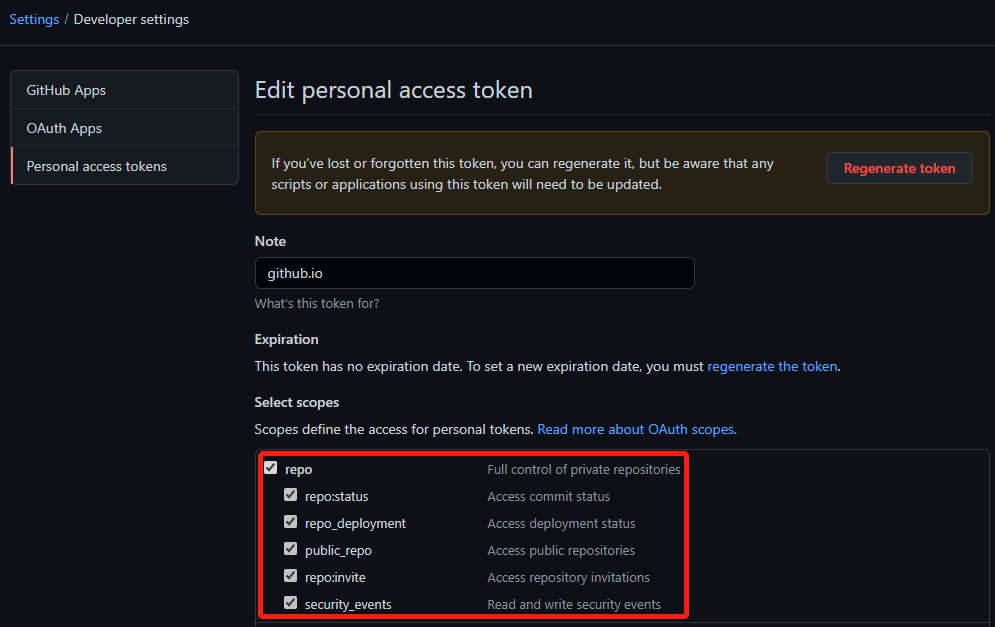
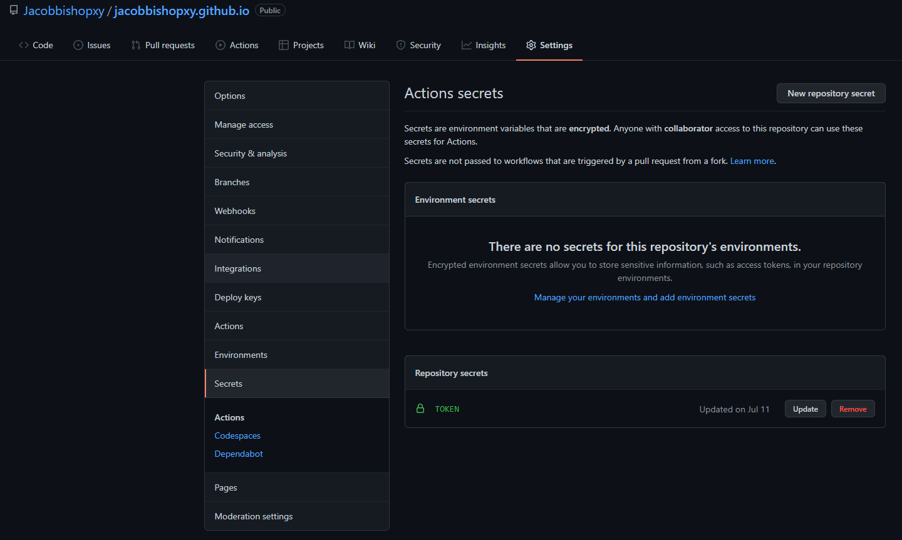
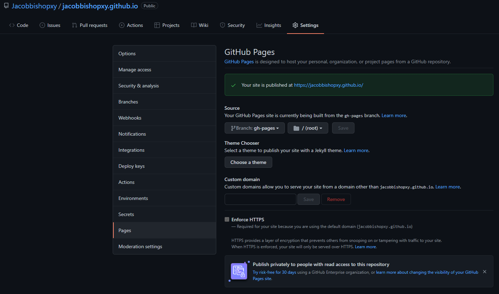

# Github.io Zola Template

A simple template for writing GitHub.io pages.

I've tried my best to recall all the steps I made while creating and deploying my own blog, but still there might be some missing steps or vague points, please feel free to leave an issue if you have any questions.

## Super duper simple process

1. Install Zola from [its release page](https://github.com/getzola/zola/releases). Alternatively, you can install Zola from its repository, for more information, see [my article](https://jacobbishopxy.github.io/posts/2021-7-1-hello-world/).

1. Fork this repository and rename it to your own. For example: `xxx.github.io`, here `xxx` is your GitHub username.

1. Create a [personal access tokens](https://github.com/settings/tokens), and select all repo.

   

1. Go to your repository's settings page and update your token:

   

1. Move `depoly.yml` to the `.github/workflows` directory. This is the file that will be used to deploy your site. For more information, please visit Zola's deployment guide [here](https://www.getzola.org/documentation/deployment/github-pages/).

1. Go to your GitHub repository and create a new branch named `gh-pages`. And then, go to the settings page to setup 'source' as following:

   

## Configure your own style

- Go get a new theme from [Zola's themes page](https://www.getzola.org/themes/). Update `Makefile` to use your theme (here I used `DeepThought` as my theme).

- Open `config.toml` file at the root of your repository, and replace all the `xxx` with your name.

- Provide your own icons and avatar under `./static` directory.

## You are ready to go

Now you can create your own markdown files in `./content/docs` and `./content/posts` directories. And each time you push your changes to GitHub, Github Actions will automatically deploy your site.

## References

- [Zola](https://www.getzola.org/)
- [How to use zola ...](https://dev.to/davidedelpapa/zola-tutorial-how-to-use-zola-the-rust-based-static-site-generator-for-your-next-small-project-and-deploy-it-on-netlify-375n)
